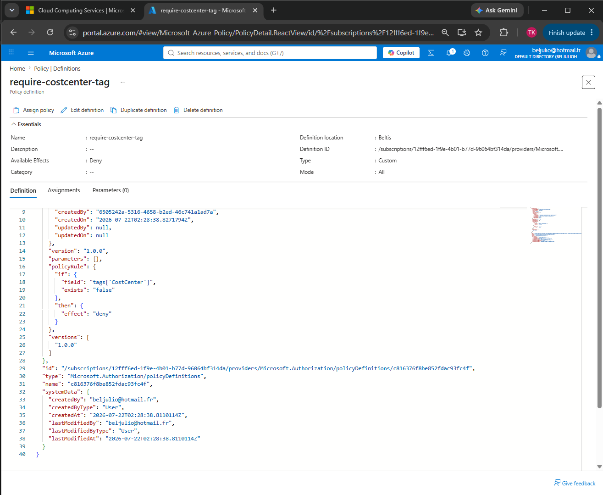
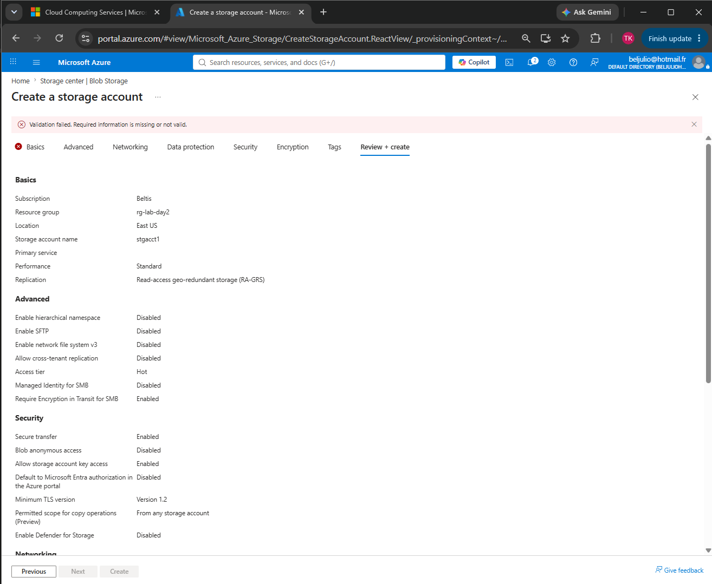
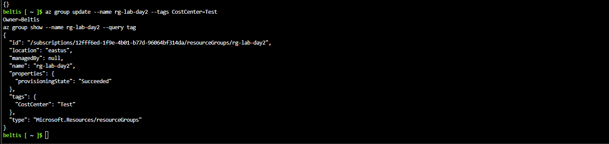

# Day 02 –  Identity & Governance II (Policy, Locks, Tags)

**Exam domain:** Identity & Governance
**Date completed:07/21/2026**

## What I built
Wrote an Azure Policy definition (require-costcenter-tag) that
denies resource creation
unless a CostCenter tag is present, assigned it to rg-lab-day2, and
proved it in action by
attempting a non-compliant storage account deployment (blocked) and
then a compliant one
with the tag added (succeeded). Added a CanNotDelete resource lock
to the resource group
and confirmed it blocks deletion until removed. Tagged the resource
group directly with
the Azure CLI

## Key commands / concepts used
({
    "policyRule": {
        "if": {
            "field": "tags['CostCenter']",
            "exists": "false"
        },
        "then": {
            "effect": "deny"
        }
    },
    "parameters": {}
})
To create a policy 

az group update --name rg-lab-day2 --tags CostCenter=Test
Owner=Beltis
az group show --name rg-lab-day2 --query tags
To create a tag

## What I learned / what surprised me
Azure Policy enforces governance proactively at deployment time — a denied deploymentshows a clear validation error citing the specific policy thatblocked it, not just ageneric failure. 
Resource locks are independent of RBAC permissions;even a user withOwner access has to remove the lock first before they can delete a locked resource

## Screenshots

